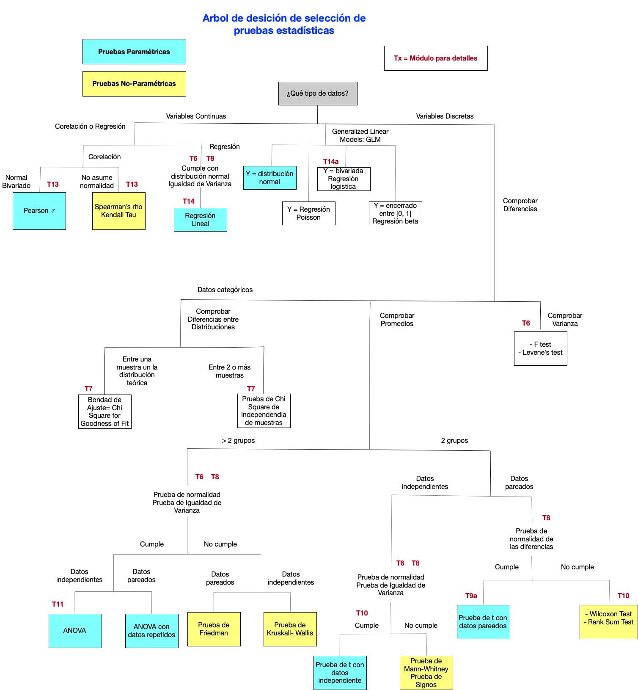

```{r setup, include=FALSE}
knitr::opts_chunk$set(echo = TRUE)
```


```{=html}
<style>
.list-group-item.active, .list-group-item.active:focus, .list-group-item.active:hover {
    background-color: #11c1d9;
}
</style>
```


Fecha de la ultima revisión
```{r echo=FALSE}

Sys.Date()
```

## BIOL4026: Ciencia de Datos con R

Este sitio es una guía para el curso de Ciencia de Datos con R, BIOL4026 en la Universidad de Puerto Rico en Humacao.  El objetivo de este sitio es presentar ejemplos de como manipular datos para sus analisis en R, presentar documentos profesionales para la ciencia y estadística intermedia. 


## Manipulando Datos, Tidyverse y presentaciones

- Visualización de datos con ggplot2
- dplyr: Transformación de datos
- Importar datos de diferentes clases
- Limpieza de datos con tidyr
- Trabajando con mapas
- Datos relacionados con dplyr
- stringr para datos en string
- Trabajando con factores con forcats
- Trabajando con fechas con lubridate
- El “pipe” con margritt
- Vectors de datos
- Modelos basicos con modelr
- Muchos modelos con purrr and broom
- El YAML header para modificar la aprencia del documento 

- Estadística intermedia
  - Selección de modelos
  - Regresión multiples
  - Regresión beta
      


```{r echo=FALSE, out.width= "100%"}
#
```
