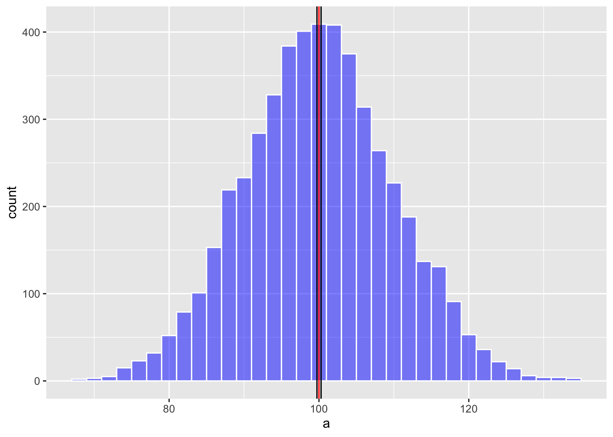

```{r setup, include=FALSE}
knitr::opts_chunk$set(echo = TRUE)
```


```{r, echo=FALSE, fig.show = "hold", out.width = "20%", fig.align = "default"}
knitr::include_graphics(c("Graficos/hex_ggversa.png", "Graficos/hex_error.png"))
```


Este documento es para enseñar a usar los códigos de RMarkdown

# Titulo

jydfgljgluygljguglugkvkhvkbv.

kjvkjhjkv;khjkk;kj;k


## Subtitulo

La especie estudiada es *Lepanthes eltoroensis* que se encuentra en **El Yunque**. 

***

> En este curso se estará enfatizando los análisis cuantitativo, esto es simplemente que analizamos los datos para llegar a una conclusión o interpretación sobre un tema. Naturalmente el proceso de seleccionar los datos puede ser un reto grande. Como uno selecciona los datos y el desarrollo de la investigación depende del diseño experimental. El diseño es el procedimiento de como uno recolecta los datos y como los vamos a analizar.  En este curso no estaremos evaluando métodos cualitativos de análisis. Este método cuantitativo se refiere a evaluar principalmente opiniones, motivaciones o razones que influencia o impacta una situación, $$A = \pi*r^{2}$$.  En los métodos cuantitativos es necesario que los resultados sean de una forma o otra numéricos o categóricos. 


```{r echo=FALSE, out.width= "45%", out.extra='style="float:right; padding:10px"'}
  # .png, .jpg, .jpeg, .tiff
```


### fyhgjk
y = x^2^

un texto importante que se refiere a una referencia^1^.

referencia (Tremblay et al. 2010)

***

* unordered list
* item 1
* item 2
    + sub-item 1 
    + sub-item 2
    
1. item 1
2. item 2
    + sub-item 1 
    + sub-item 2
3. item 3
  
  
  
Hacer tablas

Columna 1 | Columna 2
:----------:| -----------:
info 1 | 07880
info 3 | 8676887

$A = \pi*r^{2}$


#### fghjkl
##### Sitio de buscar más informacion de RStudio
  [RMarkdown Cheatsdheet](https://rstudio.com/wp-content/uploads/2015/03/rmarkdown-reference.pdf)

  -- especia 1
  
  -- especie 2
  
  --- especie 3

~~Es este texto es inecesario~~

# References

^1^[Tremblay, R. L., Ackerman, J. D., & Pérez, M. E. (2010). Riding across the selection landscape: fitness consequences of annual variation in reproductive characteristics. Philosophical Transactions of the Royal Society B: Biological Sciences, 365(1539), 491-498.](https://royalsocietypublishing.org/doi/abs/10.1098/rstb.2009.0239)
