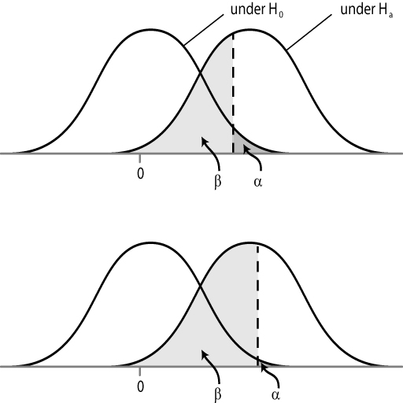

```{r setup, include=FALSE}
knitr::opts_chunk$set(echo = TRUE, warning=FALSE, message = FALSE)

```


```{r, eval=TRUE, echo=FALSE}
colorize <- function(x, color) {
  if (knitr::is_latex_output()) {
    sprintf("\\textcolor{%s}{%s}", color, x)
  } else if (knitr::is_html_output()) {
    sprintf("<span style='color: %s;'>%s</span>", color, 
      x)
  } else x
}

#`r colorize("some words in red", "red")`


```

Fecha de la ultima revisión
```{r echo=FALSE}

Sys.Date()
```

```{r, echo=FALSE, fig.show = "hold", out.width = "20%", fig.align = "default"}
knitr::include_graphics(c("Graficos/hex_ggversa.png", "Graficos/hex_error.png"))
```


# Introducción

Los parámetros versus un muestreo:  

En algunos instancia se podría calcular el parámetro (por ejemplo el promedio) en otra palabra la población (todos los individuos sin que falte ni uno). Si es así tenemos todos los datos.   Por ejemplo si la población es cuantos médicos fueron infectado por el COVID-19 en un hospital especifico entre una fechas delimitada es probable que se puede conseguir la información de cada un los médicos, y se podría calcular la proporción de infectado.   

Pero cuando la población es más grande será necesario tener solamente una muestra de la población, si se usa un método al azar de recolección de los datos uno podría inferir cual es el estado basado en las estadística recolectada.  

## Ejemplo 1:
Por ejemplo en un estudio hecho por la Dra. Patricia Burrowes sobre la frecuencia de una infección común de los coquí ella evaluó la presencia del hongo sobre la piel de estos anfibios y encontró que los individuos en bosque nublado eran más frecuentemente infectado que los del bosque enano.   Ella y sus estudiantes muestrearon 299 individuos del bosque nublado y 130 del bosque enano, este esfuerzo fue muy grande. Encontrar los coqui en el campo no fácil y no hay manera de conseguir todas las pequeñas ranas. 


 1. Costo potencial en aptitud evolutiva de *Batrachochytrium dendrobatidis* en *Eleutherodactylus coqui*, y comentarios sobre el riesgo de infección relacionado con el ambiente”. El tamaño corporal (longitud hocico acloaca) en adultos de *Eleutherodactylus coqui* infectados y no infectados con *Batrachochytrium dendrobatidis* (Bd) fue comparado para determinarel costo potencial en aptitud evolutiva de quitridiomicosis en poblaciones resistentes.  Los estudios fueron realizados en dos tipos de bosque a diferentes elevaciones, Bosque Nublado (650 m)  y Bosque Nublado Enano (850 m), en El Yunque, Puerto Rico.  Nuestros resultados demuestran que los machos infectados con Bd son significativamente más pequeños que los no infectados en el Bosque Nuboso, sin embargo no sucede lo mismo en el Bosque Nublado Enano.  Aunque las hembras que están infectadas por Bd también son más pequeñas que las no infectadas, este efecto no es estadísticamente significativo. La prevalencia de Bd y la probabilidad de infección por este hongo son significativamente más altas en el Bosque Nublado (44.1%) que en el Bosque Nublado Enano (20.7%) para ambos sexos.  Reportamos las diferencias en factores ambientales en estos dos tipos de bosque en Puerto Rico y discutimos las implicaciones en el crecimiento de Bd y la vulnerabilidad de las ranas a la infección por este patógeno. 
> 
> > Burrowes, P. A., A. V. Longo, and C. A. Rodríguez. 2008b. Potential fitness cost of *Batrachochytrium dendrobatidis* in *Eletherodactylus coqui*, and comments on environment-related risk of infection. Herpetotropicos 4:51-57.


## Ejemplo 2:

 En este segundo ejemplo se demuestra la eficiencia de dos vacunas para proteger del virus papiloma humano (VPH) que es una causa principal del cáncer del útero.  Hay un estimado que 25% de los adultos están infectado por HPV en un momento en su vida (Lowndes, doi: 10.1017/S0950268805005728) y que este cáncer es el segundo más común en el mundo (Bosch et al. 2002, doi: 10.1136/jcp.55.4.244). El siguiente ejemplo demuestra que las vacunas pueden ser muy efectiva. 


¿Qué tan eficaces son las vacunas contra el VPH?


Las vacunas contra el VPH son altamente eficaces para prevenir la infección por los tipos de VPH a los que atacan cuando las vacunas se administran antes de la exposición inicial al virus — es decir, antes de que el individuo tenga actividad sexual.


 2. En los estudios que llevaron a la aprobación de Gardasil y de Cervarix, se encontró que estas vacunas proveen casi 100 % de protección contra infecciones persistentes del cuello uterino por los tipos 16 y 18 de VPH y contra los cambios celulares del cuello uterino que pueden causar estas infecciones persistentes.Gardasil 9 es tan eficaz como Gardasil para la prevención de las enfermedades causadas por los cuatro tipos de VPH (6, 11, 16 y 18), según reacciones similares de anticuerpos en participantes de estudios clínicos. Los estudios que llevaron a la aprobación de Gardasil 9 encontraron que es casi 100 % eficaz en la prevención de enfermedades cervicales (de cuello uterino), de vulva y de vagina causadas por los otros cinco tipos de VPH (31, 33, 45, 52 y 58) a los que se dirige (4). En un documento de posición de 2017, la Organización Mundial de la Salud declaró que las vacunas contra el VPH tienen una eficacia equivalente (5). Se ha encontrado que Cervarix provee protección parcial contra algunos otros tipos de VPH que pueden también causar cáncer pero que no están incluidos en la vacuna, un fenómeno llamado protección cruzada (6).
>

> > Fuente de información: <https://www.cancer.gov/espanol/cancer/causas-prevencion/riesgo/germenes-infecciosos/hoja-informativa-vacuna-vph>


# Inferencias en estadística

El concepto de inferencias en estadística se refiere al proceso de hacer conclusiones basado en un muestreo.  Por ejemplo en el primer ejemplo de la infección de hongos en los coquis, uno podría inferir que la proporción de ranas infectada será igual (o muy similar) en otros bosques nublados y enanos de Puerto Rico.  

# Hipótesis 

En la sección 6.2 del libro de Havel et al.  leer y evaluar la tabla 6.2 para tener unos ejemplos de expresiones que no son una hipótesis y lo que es son.   NOTA: importante es el autor menciona aquí son las hipótesis alterna, en otra palabra los que uno piensa que podría ocurrir.   Pero esa no es la hipótesis que se prueba, lo que se prueba es la hipótesis NULA, Ho. Cuando se dice la hipótesis NULA es que no hay diferencias entre los grupos.  Vea la tabla 6.2 del libro para más ejemplos. 

Ejemplo de hipotesis Nula y Alterna

|  | NULA, Ho  | ALTERNA, Ha | No es una hipótesis  |
|----|-------:|:---------:|:-------------:|
| 1  | Tratamiento con la vacuna de Salk no tiene efecto sobre el riesgo de infección de polio en niños   |      El efecto de la vacuna Salk reduce el riesgo de infección de polio en los niños     | El polio es malo |
| 2  | Los Beatles no vendieron más discos que cualquier otros grupos de rock    |  Los Beatles vendieron más discos que cualquier otro grupo de rock         | La música delos Beatles es obsoleta       |


# El valor de p

El valor de *p* es la probabilidad de tener una estadística tan extrema si la hipótesis es verdad (en otra palabra la Ho es la correcta).  Uno podría decir que es un indice de la evidencia **CONTRA** la hipótesis NULA.  PERO NOTA es incorrecto decir que es la probabilidad que la Ho es correcta.  

Antes de comenzar a hacer el estudio se debería *a priori* tener una decisión cual sera el nivel de **alpha**, $\alpha$ para rechazar la hipótesis nula. Típicamente el valor critico de $\alpha$ es 0.05 o 5%.  Esto quiere decir que si uno repite el experimento 100 veces 5 veces la investigación nos va a dar una resultado equivocado. Que se rechaza la Ho cuando se debería aceptar. Esto una vez en cada 20 experimentos con las mismas condiciones.  En muchas ramas de investigación como la física el nivel de $\alpha$ es frecuentemente 0.01 o menos.  

# Los errores de tipo I y tipo II

Vea el modulo T1.  


# El poder de las pruebas inferenciales y lo parámetros que lo influencia

Si la hipótesis nula es falsa es probable que se podría rechazar con cierta confianza. El complemente de beta,  $(1-\beta)$ es la prueba de poder.  La prueba de poder es la probabilidad de correctamente rechazar la hipótesis nula falsa. Para aclara la $\beta$ es la probabilidad de cometer un error tipo II. El Poder es $(1-\beta)$ es la probabilidad de correctamente rechazar una hipótesis nula falsa.  

Evalúa el siguiente gráfico:

La prueba de poder es influenciada por tres propriedades.

+ El nivel del tipo de error I, o sea el $\alpha$.
+ La diferencia entre dos promedios que queremos evaluar.
+ El tamaño de muestra (n).

La linea vertical entrecortada representa el valor critico. El área gris obscuro representa el error $\alpha$, la probabilidad de rechazar la hipótesis nula cuando debería aceptar la hipótesis nula.  El área gris liviano representa el error $\beta$.   

```{r echo=FALSE, out.width = '50%'}

```
Una ilustración de como el $\alpha$ afecta el $\beta$"


