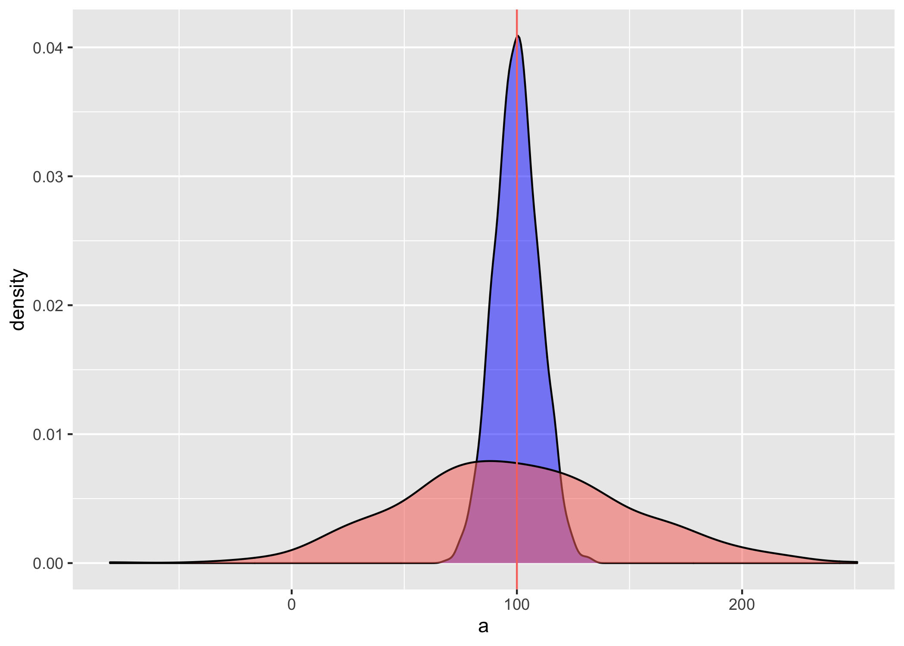
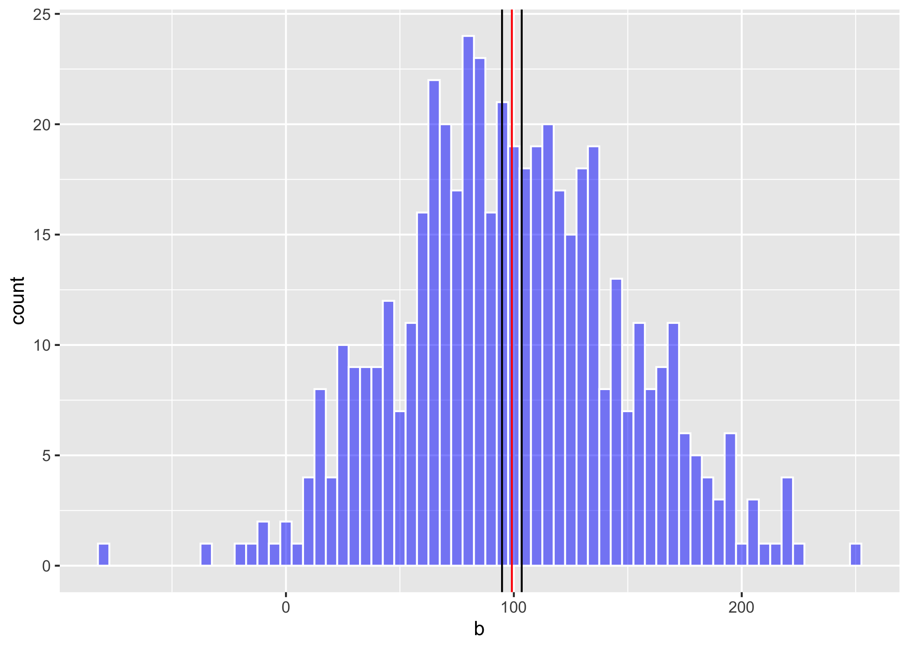

```{r setup, include=FALSE}
knitr::opts_chunk$set(error=TRUE, 
                      echo = TRUE, 
                      warning=FALSE, 
                      message = FALSE)
```

Fecha de la ultima revisión
```{r echo=FALSE}

Sys.Date()
```

```{r, echo=FALSE, fig.show = "hold", out.width = "20%", fig.align = "default"}
knitr::include_graphics(c("Graficos/hex_ggversa.png", "Graficos/hex_error.png"))
```


```{r, ch1}


library(ggplot2)
library(Hmisc)
library(gridExtra) # Un paquete para organizar las figuras de ggplot2
library(gt)
library(tidyverse)
```


***

# Que es la dispersión en estadística


Las medidas o indices de dispersión, son indicadores de cuan variable los datos son uno del otro. Si todos los valores tienen el mismo valor no hay dispersión.  Hay múltiples indices de dispersión vamos a evaluar solamente algunos de estos indices, para más información pueden ir al siguiente enlace <https://en.wikipedia.org/wiki/Statistical_dispersion>.  

Los indices que estaremos estudiando son los siguientes

  - el rango
  - la varianza
  - la desviación estándar
  - el error estándar.
 
 
# Vizualizando la dispersión 
  
Primero miramos un gráfico donde tenemos datos donde el promedio es igual pero la dispersiones son diferentes. Lo que uno observa es que en la distribución azul los datos son más similares uno al otro y la distribución roja los valores son más diferentes.  En el primer conjunto de datos se usa 5000 valores con un promedio de 100 y una desviación estándar de 10, en el segundo se produce un conjunto de datos de 500 valores con un promedio de 100 y una desviación estándar de 30.


```{r, ch2}

set.seed(8690) # esto es para que los valores se queda igual a cada vez que se corre el analisis
a=rnorm(5000, 100, 10) # la función para generar datos al azar con una distribución normal
dfa=data.frame(a)
 # r is for random
 # norm =distribución normal

b=rnorm(500, 100, 50)
dfb=data.frame(b)
```


```{r, ch3, out.width = '60%'}
dispersion=ggplot(dfa, aes(a))+
  geom_density(fill="blue", alpha=.5)+
  geom_density(dfb, mapping=aes(b,fill="red", alpha=.5 ))+
  theme(legend.position = "none") +
  geom_vline(aes(xintercept = 100, colour="red"))
ggsave("Graficos/dispersion.png")
```

```{r, ch4, echo=FALSE, fig.align='center', out.width = '60%'}

```


***

# El rango

El rango son los valores mínimo y valor máximo de un conjunto de datos.  Se usa la función **range()**.  Usamos los dos conjuntos de datos ya creado anteriormente para visualizar los rangos de la distribuciones de los gráficos. Lo que uno observa es que el valor mínimo del primer conjunto de datos es 59.17 y el máximo es 137.12.  Para el segundo conjunto de datos el valor mínimo es 1.86 y el máximo es 203.88.  


```{r, ch5}
range(dfa$a)
range(dfb$b)

```

# Ejemplo de la clase

## Cual es el rango de la Edad de los padres de los Estudiantes


```{r, ch6}
Edad=c(57,50,43,39,54,50,59,49, 57,51,43,47)
Edad
Edad_df=data.frame(Edad)
Edad_df
range(Edad)
range(Edad_df$Edad)
```


## La varianza

Los pasos para calcular la varianza son los siguientes

+ tener un conjunto de datos, aquí lo llamamos **Data**
+ convertir esta lista en un data frame 
+ Calcular el promedio de los datos
+ restar el promedio de cada valor y cuadralos
+ Sumar y restas de **n-1**, done **n** es la cantidad de datos


$${ s }^{ 2 }=\frac { \sum { { ({ x }_{ i }-\bar { x }  })^{ 2 } }  }{ n-1 }$$

```{r, ch7}
library(tidyverse)
Data=c(1,2,3,4,5,6)
Data_df=data.frame(Data)
Data_df
Data_df$mean_Data=mean(Data)   # Aqui se añade el promedio a cada fila
Data_df
Data_df$Diff=Data_df$Data-Data_df$mean_Data 
          # Calcular la diferencia entre el promedio y el valor x
sum(Data_df$Diff) # si los valores no se cuadra la suma sera zero.

Data_df$SS=(Data_df$Data-Data_df$mean_Data)^2 # SS para la suma de los cuadrados 
Data_df
sum(Data_df$SS)
 #  Este indice se llama la desviación del promedio que es la suma de los cuadrados
```
***

## Calcular la varianza con **var()**

Ahora la manera fácil de hacer los análisis, usar la función **var**, y no hay que hacer ninguno de los pasos anteriores.   Pero es importante que sepa como es el procedimiento de calcular la varianza. Nota que la varianza es un indice de la diferencia entre el promedio y cada valor.  El otro paso es que los valores tienen que estar cuadrada las diferencias sino la suma sera de cero.   Se usa el variancas cuando tenemos confianzas que los datos provienen de una distribución normal y que los datos que uno tiene no están sesgados.   

```{r, ch8}
var(Data)
```

*** 


# La desviación estandar

La varianza es un indice que no esta en la misma unidad que los valores recolectado, por ejemplo si se recolecta los datos en centímetros, la varianza es en centímetros cuadrados. Por consecuencia no es necesariamente el mejor para describir la dispersión. Entonces hay que sacar la raíz cuadra de la varianza. La desviación estándar es un indice que se usa para describir la dispersión de una población, en otra palabra cuan diferentes son los datos uno del otro.   Se usa el desviación estándar cuando tenemos confianzas que los datos provienen de una distribución normal y que los datos que uno tiene no están sesgados.   
  
  $${ s }=\sqrt { \frac { \sum { { ({ x }_{ i }-\bar { x }  })^{ 2 } }  }{ n-1 }  }$$ 
  o más sencillo
  
  $$s=\sqrt{s^2}$$
  
la función **sd**, "standard deviation" es sumamente facil de calcular en R. 


```{r, ch9}
sd(Data_df$Data)  # deviación estandard
```

***

# El rango intertcuartil.

La función básica es **quantile** si lo dejamos sin más instrucción calcula los siguientes probabilidades 0%, 25%, 50% (mediana), 75%, 100%.  Pero si uno quiere los valores que se encuentra en una posición especifica hay que usar **type =1** como se ve en el segundo ejemplo.  Hay 9 tipos de cuantiles con esta función, estos se encuentra definido en RStudio. Añade **quantile** en el artea de **help** y vera las otras alternativas.   

```{r, ch10}
quantile(Data) # la función básica (0%, 25%, 50% (mediana), 75%, 100%)

# Seleccionar los cuantiles específicos.
quantile(Data, probs = c(0.015, 0.25, 0.50,.75, .975))   
```


Para explicar estos conceptos mejor visualizamos los datos 


| i  | x[i]  | Mediana | Cuartiles   |
|----|-------:|:---------:|:-------------:|
| 1  | 03    |           |  |
| 2  | 19     |           |          |
| 3  | 27      |         |             |
| 4  | 33    |         |    Q1=33         |
| 5  | 52    |         |             |
| 6  | 60    |         |            |
| 7  | 77    |         |             |
| 8  | 87    |  Q2=87       |             |
| 9  | 99    |       |             |
| 10 | 101   |         |             |
| 11 | 122   |         |             |
| 12 | 137   |         | Q3=137    |
| 13 | 140   |         |             |
| 14 | 142   |         |             |
| 15 | 150   |         |             |

Ahora usamos la función **quantile** con el type=1 de calcular los cuartiles y vermos si tenemos los mismos resultados.  
```{r, ch11}

dat=c(3,19,27,33,52,60,77,87,99,101,122,137,140,142,150)

quantile(dat, type =1)

sd(dat)

```


***

# El error estandard

El termino correcto es el *error de las desviación estándar* pero típicamente acortado a *error estándar*. El indice de error estándar es para describir cual es la posible dispersión del promedio.  En otra palabra cuan confiado estamos con el estimado del promedio.  Más grande el error estándar menos confiado estamos con el promedio.   Se usa el error estándar cuando tenemos confianzas que los datos provienen de una distribución normal y que los datos que uno tiene no están sesgados.   

La formula de error estándar es la siguiente usando la desviación estándar

$$s_{\overline{x}}=\frac{s}{\sqrt{n}}$$
o usando la varianza, donde la **n** es la cantidad de datos

$$s_{\overline{x}}=\sqrt{\frac{s^2}{n}}$$
Ahora si usamos los datos enseñado al principio del modulo. Calculamos error estándar de ambas distribución.  er= error estándar. No hay función en R para calcular el error estándar, por consecuencia hay que crear la formula para calcular el indice.  Vemos que cuando hay más dispersión el error estándar es más grande.  

```{r, ch12}
length(dfa$a)
es_a= sd(dfa$a)/sqrt(length(dfa$a))

es_b= sd(dfb$b)/sqrt(length(dfb$b))

es_a
es_b
```

***

# El intervalo de confianza de 95% del promedio

Ya que hemos calculado el error estándar podemos calcular la dispersión de los promedios. Esto quiere decir que si uno repite la recolección de datos el promedio tiene un 95% de probabilidad estar en este rango.  Uno calcula los limites de la dispersión de los promedios usando la siguientes formulas.  

$$Limite\ 95\%\ ariba=\ \overline{x}\ +\left(ES\ \cdot\ 1.96\right)$$


$$Limite\ 95\%\ abajo=\ \overline{x}\ -\left(ES\ \cdot\ 1.96\right)$$

```{r, ch13}
Limite_inferior_a=mean(dfa$a)-(es_a*1.96)

Limite_superior_a=mean(dfa$a)+(es_a*1.96)

Limite_inferior_a # limite inferior 95%
mean(dfa$a)   # El promedio
Limite_superior_a # el limite superior 95%
```

```{r, ch14}
Limite_inferior_b=mean(dfb$b)-(es_b*1.96)
Limite_superior_b=mean(dfb$b)+(es_b*1.96)

mean_b=mean(dfb$b)
Limite_inferior_b
mean(dfb$b)
Limite_superior_b
```

Visualizando el intervalos de confianza del promedio. Lo que uno observa es que primero el promedio puede ser en localidad diferentes porque el conjunto de datos fue menos en el segundo gráfico. Además vemos que el intervalo de 95% de confianza del promedio en el segundo es más amplio.  

```{r, ch17}
CI_a1=ggplot(dfa, aes(a))+
  geom_histogram(fill="blue", colour="white",alpha=.5, binwidth = 2)+
  theme(legend.position = "none") +
  geom_vline(aes(xintercept = 100), colour="red")+
  geom_vline(aes(xintercept = Limite_inferior_a), colour="black")+
  geom_vline(aes(xintercept = Limite_superior_a), colour="black")
ggsave("Graficos/CI_a1.png")
```


```{r,  echo=FALSE, fig.align='center', out.width = '60%'}
knitr::include_graphics("Graficos/CI_a1.png")
```


```{r fig.align='center', warning=TRUE}

CI_b=ggplot(dfb, aes(b))+
  geom_histogram(fill="blue", colour="white", alpha=.5, binwidth = 5)+
  theme(legend.position = "none") +
  geom_vline(aes(xintercept =mean_b), colour="red")+
  geom_vline(aes(xintercept = Limite_inferior_b), colour="black")+
  geom_vline(aes(xintercept = Limite_superior_b), colour="black")


ggsave("Graficos/CI_b.png")
```

```{r,  echo=FALSE, fig.align='center', out.width = '60%'}

```


```{r eval=FALSE, include=FALSE}

#library(cowplot)
#grDevices::pdf(NULL)
#g2<-plot_grid(CI_a,CI_b)
#grDevices::dev.off()
#g2
```


```{r, }
#library(easyGgplot2)
#ggplot2.multiplot(CI_b.png,CI_b.png, cols=2)
```

```{r eval=FALSE, include=FALSE}
#library(png)
#library(grid)
#library(gridExtra)

#plot1 <- readPNG('Graficos/CI_a.png')
#plot2 <- readPNG('Graficos/CI_a.png')

#grid.arrange(rasterGrob(plot1),rasterGrob(plot2),ncol=2)
```


***

## El intervalos de confianza de los datos

Para tener una idea de la distribución de los datos y cual es el porcentaje de valores que esté incluido (asumiendo una distribución normal). Podemos crear un gráfico que demuestra el porcentaje incluidos basado en la desviación estándar.  Nota aquí no es la dispersión del promedio pero la dispersión de los datos en la población.  


***

## Rangos incluidos en intervalos de confianza 

Cálculos el promedio y la desviación estándar de los datos.  Lo haremos por genero.  Si uno calcula el rango de promedio ± 1 sd, esto incluye 68.2% de los datos, si incluimos el promedio ± 2 sd incluye 95.6% de los datos, 


```{r table1, echo=FALSE, message=FALSE, warnings=FALSE, results='asis'}
require(pander)
panderOptions('table.split.table', Inf)
set.caption("Rangos incluidos en intervalos de confianza")
my.data <- "
| sd  | rango inluido |
| 0  | el promedio    | 
| ±1 |  68.2% |
| ±2 |  95.6% |
| ±3 | 99.7% |
| ±4 | 99.99% |"

df <- read.delim(textConnection(my.data),header=FALSE,sep="|",strip.white=TRUE,stringsAsFactors=FALSE)
names(df) <- unname(as.list(df[1,])) # put headers on
df <- df[-1,c(-1,-4)] # remove first row
row.names(df)<-NULL
pander(df, style = 'rmarkdown')
```

***

# Ejemplo del intervalo de confianza

## El intervalo de  confianza de colesterol en los Iranis

Comenzamos con evaluar el intervalo de confianza de los datos con datos teóricos.  Por ejemplo el nivel de colesterol en el plasma varia en los humanos.  En el siguiente articulo *Plasma total cholesterol level and some related factors in northern Iranian people*. <https://www.ncbi.nlm.nih.gov/pmc/articles/PMC3783780/>  

Usamos los datos para las mujeres con un promedio de 196.7 y una desviación estándar de 39.11.  Con estos datos asumimos que esto provienen de una distribución normal y que representa las mujeres en resto del mundo.   

```{r}
# Creamos un conjunto de datos para los análisis

Col=rnorm(200000, 196.7, 39.11)
Col=data_frame(Col)

promCol=Col%>%
  summarise(Mean=mean(Col))
  
sdCol=Col%>%
  summarise(sd=sd(Col))

```

***

Visualizar los datos:  Uds conoce su nivel de colesterol total?  Donde se encuentra en esta distribución?  Se encuentra en el 68%?   Nota que la suma de todos los porcentaje es igual a 100%.  


```{r, out.width = '60%'}
library(grid)
library(gtable)

lims <- c(28, 350)

breaks.major2<-c(0, 79, 118, 157, 
                 197, 235, 274, 314)
breaks.minor2= c(79, 118, 157,197, 
                235, 274, 314,379)
breaks.comb <- sort(c(breaks.major2, breaks.minor2-1.0E-6))
labels.comb<- c(0, 79, "\n-3sd", 118, "\n-2sd", 157, "\n-1sd", 197, "\npromedio",
                 235,  "\n+1sd",274, "\n+2sd", 314,"\n+3sd", 379)
```


```{r}
Colesterol_Inter=Col%>%
ggplot(aes(Col))+
  geom_histogram(fill="blue", colour="white",alpha=.5, binwidth = 5)+
  theme(legend.position = "none")+
  geom_vline(xintercept=as.numeric(promCol), colour="black")+
  geom_vline(aes(xintercept = as.numeric(promCol-sdCol)), colour="blue")+
  geom_vline(aes(xintercept = as.numeric(promCol+sdCol)), colour="blue")+
geom_vline(aes(xintercept = as.numeric(promCol-2*sdCol)), colour="red")+
  geom_vline(aes(xintercept = as.numeric(promCol+2*sdCol)), colour="red")+
geom_vline(aes(xintercept = as.numeric(promCol-3*sdCol)), colour="orange")+
  geom_vline(aes(xintercept = as.numeric(promCol+3*sdCol)), colour="orange")+
  scale_x_continuous(expand=c(0,0), limit=lims, 
                                minor_breaks=breaks.minor2, 
                                breaks=breaks.comb,
                                labels=labels.comb)+
  xlab("Nivel de colesterol")+
  annotate("text", x=180, y = .004, label="34.1%")+
  annotate("text", x=210, y = .004, label="34.1%")+
  annotate("text", x=140, y = .002, label="13.6%")+
  annotate("text", x=250, y = .002, label="13.6%")+
  annotate("text", x=90, y = .001, label="2.1%")+
  annotate("text", x=295, y = .001, label="2.1%")+
  annotate("text", x=70, y = .0005, label="0.1%")+
  annotate("text", x=330, y = .0005, label="0.1%")

ggsave("Graficos/Colesterol_Inter.png")

```


***

## Otro ejemplo de los intevalos de confianzas

### La altura de los humanos


Para evaluar el 95% de intervalo de confianza usaremos datos de la alturas de 500 adultos. Estos datos fueron bajado del siguiente website. Están disponible en debajo la pestaña de "Los Datos".  <https://www.kaggle.com/yersever/500-person-gender-height-weight-bodymassindex/data>


***

```{r}
library(readr)
library(gt)
Alturas_Humanos <- read_csv("Data_files_csv/Alturas_Humanos.csv")
gt(head(Alturas_Humanos))
```


Calculamos los promedios y las desviación estándar para añadirlos al gráfico 


```{r, out.width = '60%'}
library(tidyverse)
head(Alturas_Humanos)
length(Alturas_Humanos$Genero)


# Parametros para las Mujeres
promM=Alturas_Humanos%>%
  dplyr::select(Genero, Altura_cm)%>%
  filter(Genero=="Mujer")%>%
  summarise(MeanM=mean(Altura_cm))
promM 

sdM=Alturas_Humanos%>%
  dplyr::select(Genero, Altura_cm)%>%
  filter(Genero=="Mujer")%>%
  summarise(sd=sd(Altura_cm))
 sdM 

# Parametros para las Hombres
promH=Alturas_Humanos%>%
  dplyr::select(Genero, Altura_cm)%>%
  filter(Genero=="Hombres")%>%
  summarise(Mean=mean(Altura_cm))


sdH=Alturas_Humanos%>%
  dplyr::select(Genero, Altura_cm)%>%
  filter(Genero=="Hombres")%>%
  summarise(sd=sd(Altura_cm))

```

Aquí el gráfico de la distribución de los datos con un histograma, y promedio (negro), el rango de 68% entre las barras azules y el de 95% entre las barras roja.


```{r, out.width = '60%'}
Alturas_Mujer=Alturas_Humanos%>%
  dplyr::select(Genero, Altura_cm)%>%
  filter(Genero=="Mujer")%>%
ggplot(aes(Altura_cm))+
  geom_histogram(fill="blue", colour="yellow",alpha=.5)+
  theme(legend.position = "none")+
  geom_vline(xintercept=as.numeric(promM), colour="black")+
  geom_vline(aes(xintercept = as.numeric(promM-sdM)), colour="blue", size=1)+
  geom_vline(aes(xintercept = as.numeric(promM+sdM)), colour="blue")+
geom_vline(aes(xintercept = as.numeric(promM-2*sdM)), colour="red")+
  geom_vline(aes(xintercept = as.numeric(promM+2*sdM)), colour="red")


ggsave("Graficos/Alturas_Mujer.jpeg") # .png, .tiff, etc
```


```{r echo=FALSE, out.width= "60%"}
knitr::include_graphics("Graficos/Alturas_Mujer.jpeg")
```


***

### Ejercicio: Ahora prepara el mismo gráfico para los hombres.  

```{r eval=FALSE, include=FALSE}

#library(devtools)
#install_github("kassambara/easyGgplot2")
```

 


