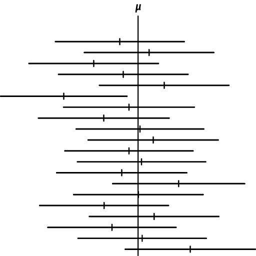

```{r setup, include=FALSE}
knitr::opts_chunk$set(echo = TRUE, warning=FALSE, message = FALSE)

```


```{r}
library(gridExtra)
```


```{r, echo=FALSE}
library(tidyverse)

rlt_theme <- theme(axis.title.y = element_text(colour="grey20",size=15,face="bold"),
        axis.text.x = element_text(colour="grey20",size=10, face="bold"),
        axis.text.y = element_text(colour="grey20",size=15,face="bold"),  
        axis.title.x = element_text(colour="grey20",size=15,face="bold"))+
  theme(
  # Remove panel border
  panel.border = element_blank(),  
  # Remove panel grid lines
  panel.grid.major = element_blank(),
  panel.grid.minor = element_blank(),
  # Remove panel background
  panel.background = element_blank(),
  # add thicker border lines
    axis.line.x = element_line(colour = "black", size = 1),
    axis.line.y = element_line(colour = "black", size = 1)
  )

# The palette with grey:
cbPalette1 <- c("#999999", "#E69F00", "#56B4E9", "#009E73", "#F0E442", "#0072B2", "#D55E00", "#CC79A7")

# The palette with black:
cbPalette2 <- c("#000000", "#E69F00", "#56B4E9", "#009E73", "#F0E442", "#0072B2", "#D55E00", "#CC79A7")

# To use for fills, add
#  scale_fill_manual(values=cbPalette)

# To use for line and point colors, add
  #scale_colour_manual(values=cbPalette)

```

```{r, eval=TRUE, echo=FALSE}
colorize <- function(x, color) {
  if (knitr::is_latex_output()) {
    sprintf("\\textcolor{%s}{%s}", color, x)
  } else if (knitr::is_html_output()) {
    sprintf("<span style='color: %s;'>%s</span>", color, 
      x)
  } else x
}

#`r colorize("some words in red", "red")`


```

Fecha de la ultima revisión
```{r echo=FALSE}

Sys.Date()
```


```{r, eval=TRUE, echo=FALSE}
colorize <- function(x, color) {
  if (knitr::is_latex_output()) {
    sprintf("\\textcolor{%s}{%s}", color, x)
  } else if (knitr::is_html_output()) {
    sprintf("<span style='color: %s;'>%s</span>", color, 
      x)
  } else x
}

#`r colorize("some words in red", "red")`


```


```{r, echo=FALSE, fig.show = "hold", out.width = "20%", fig.align = "default"}
knitr::include_graphics(c("Graficos/hex_ggversa.png", "Graficos/hex_error.png"))
```


***

# El promedio, un estimado

En este modulo se evalúa el promedio y la propriedades de una distribución normal y el muestreo de para estimar el promedio. En el módulo se evalúa la hipótesis de un muestreo y se estima el intervalo de confianza para estimar el posible rango del promedio.  Es importante reconocer que el muestreo para estimar el promedio $\overline{x}$ es solamente un estimado.  En otra palabra no es necesariamente la VERDAD, o dicho de forma estadística, el promedio del universo, $\mu$ de esta variable. 


Con frecuencia se quiere saber conocer información sobre el verdadero promedio, $\mu$ basado en un muestreo.  Por ejemplo cual es promedio de la edad de las Palmas de Sierra en Puerto Rico, cual es el promedio de la presión arterial de los humanos, cual es la producción promedio de mangos en los arboles de mangos.  En cada caso no sabemos cual es el promedio universal, $\mu$ y tampoco no sabemos el valor exacto de la desviación estándar $\sigma$.  

Para evaluar la hipótesis sobre el promedio de la población $\mu$, uno puede utilizar datos recogido al azar, un muestreo y usar estos para inferir cual es el promedio y desviación estándar del universo.

## Ejemplo 9.1 y 9.2. 

Leen estos dos ejercicios, y considera cual es son los valores del universo,$\mu$ y $\sigma$ y el promedio del muestreo $\overline{x}$. 

# La distribución de t

Cuando queremos inferir información del promedio o la desviación del universo de un muestreo hay que utilizar la distribución de t.  La razón es que la forma de la distribución normal cambia con el tamaño de muestra cuando no sabemos cual es la desviación estándar del universo.  A medida que uno reduce el tamaño de muestra la distribución se desvía de una distribución normal.  Para tomar esto en cuenta no usamos la distribución normal la de distribución de t, también se dice la distribución de t de estudiante.  


```{r include=FALSE}
x <- seq(from=-5, to=5, by=0.1)

df1=plot(function(x) dt(x, df = 1), -7, 7, ylim = c(0, 0.42),
     main="", yaxs="i")
df1x=df1$x
df1y=df1$y

df=cbind(df1x, df1y)
df

df3=plot(function(x) dt(x, df = 3), -7, 7, ylim = c(0, 0.42),
     main="", yaxs="i")
df3x=df3$x
df3y=df3$y

df3=cbind(df3x, df3y)

df5=plot(function(x) dt(x, df = 5), -7, 7, ylim = c(0, 0.42),
     main="", yaxs="i")

df5x=df5$x
df5y=df5$y

df5=cbind(df5x, df5y)

dfinf=plot(function(x) dt(x, df = 1000000), -7, 7, ylim = c(0, 0.42),
     main="", yaxs="i")

dfinfx=dfinf$x
dfinfy=dfinf$y

dfinf=cbind(dfinfx, dfinfy)


```

```{r include=FALSE}
dfc=cbind(df1x, df1y, df3y, df5y, dfinfy )
dfcc=as.data.frame(dfc)
dfcc
head(dfcc, n=4)

```


```{r include=FALSE}
library(tidyverse)
out <- dfcc %>% 
         gather(key=df, val, -df1x)%>%
  arrange(desc(df1x))
head(out, 12)
```


```{r}
ggplot(out,aes(df1x, val, colour=df) )+
  geom_line()+
  rlt_theme+
  scale_colour_manual(name = "Grado de \nlibertad", values = c("blue", "red", "springgreen4", "black"), 
                     labels = expression(nu[1], nu[2],nu[5], nu[infinity]))+
                     theme(legend.position = c(0.8, 0.8))+
                     xlab("Valores")+
                     ylab("Densidad")
```

Observa que la distribución de t, cambia dependiendo la forma de la densidades con el tamaño de muestra, (grado de libertad es $\nu=n-1$).  Tiene que observar dos componentes 1. hay menos datos en  centrado en el promedio y 2. hay más datos en la colas.  

Se usa la distribución de t para calcular el intervalo de confianza y la hipótesis del promedio de una muestra, debido que la forma de la distribución de t cambia con el tamaño de muestra $\nu=n-1$ y también con la razón de error Tipo I, $\alpha$.  

***

# Cuando es que uno rechaza la hipótesis nula

Regresamos a la idea de Tipo de error I.  Cuando se selecciona un $\alpha=0.05$, lo que estamos diciendo es que hay 5% de probabilidad de cometer un error Tipo 1, que es `r colorize("de rechazar la hipótesis nula cuando uno debería aceptarla", "blue")`. Ahora este 5% puede estar divido en dos componentes, uno cuando el valor es más pequeño o más grande que el valor observado. Por consecuencia el área de rechazar la hipótesis nula es 0.025 en la parte negativa y positiva.

Seleccionamos la curva con un grado de libertad de 5 y evaluamos el área de la curva que esta dentro del 95% del intervalo de confianza y lo fuera de este rango.  Si el promedio estimado de una prueba de t es dentro del área en gris se aceptará la hipótesis nula, si esta en el área rojo se rechazara la hipótesis nula.  NOta que para esta hipótesis hay son maneras de rechazar la hipótesis nula.   


```{r include=FALSE}
library(tidyverse)


subdf5=out%>%
  dplyr::select(df, df1x,val)%>%
filter(df=="df5y")
subdf5
  
 d5=ggplot(subdf5, aes(df5x, val) )+
  geom_area(fill="grey")+
  xlab("Valores")+
  ylab("Densidad")
d5

rand5=2.571

# subset region and plot
db5 <- ggplot_build(d5)$data[[1]]
head(db5, n=3)
```

```{r echo=FALSE}

d6 <- d5 + geom_area(data = subset(db5, x > rand5), aes(x=x, y=y), fill="red")+
  geom_area(data = subset(db5, x < -rand5), aes(x=x, y=y), fill="red")+
  rlt_theme
d6

```

***

La alternativa es que nuestra hipótesis sea nada más de un lado donde el total del 5% es en la parte inferior o superior.  En esta caso se rechaza solamente si se encuentra en esta proporción de los valores de t.  Nota ahora que el área en esta sección es más grande (incluye más valores, no solamente el 2.5% pero el 5% de los valores).  


```{r echo=FALSE}

randsup=2.015
d8 <- d5 + geom_area(data = subset(db5, x > randsup), aes(x=x, y=y), fill="red")+
  rlt_theme


d7 <- d5 + 
  geom_area(data = subset(db5, x < -randsup), aes(x=x, y=y), fill="red")+
  rlt_theme

gridExtra::grid.arrange(d7,d8, ncol=2)
```

***

# El intervalo de confianza de $\mu$


Ahora se demuestra como calcular el intervalo de confianza de $\mu$.  Seleccionando un conjunto de datos al azar **n** se puede calcular el promedio $\overline{x}$ y el estimado de la desviación estándar **s**, con estos valores podemos calcular el rango donde pudiese estar el promedio del universo $\mu$ con cieto nivel de confianza (Tipo de Error I, $\alpha$).  

## Ejamplo 9.3

  Se selecciona 20 peces machos de una misma especie en un riachuelo de Puerto Rico y se mide el largo en millimetros. El promedio es $\overline{x}=21.0mm$ y una desviación estándar $s=1.76mm$. Queremos construir in intervalo de confianza de 95%. El tamaño de los peces es aproximadamente normal.  

Queremos calcular intervalo que incluye 95%, por consecuencia es el rango que hay en el área gris de la primera figura.  

# Los limites del intervalo


Para calcular el intervalo se necesita se necesita solamente el valor de t con la tipo de error I de 95% y que corresponde a un tamaño de muestra de 20, $t_{0.05,\ n-1}$. Para conocer este valor hay que ir a una tabla de la distribución de t (vea p. 217 en el libro) o usar R para calcular el valor.  En la tabla busca el error I deseado (0.05) y se busca el grado de libertad *n-1*, $t_{0.05,\ 19}$. El valor del libro es $t = 2.093$. Si se quisiera un Tipo de error I con solamente 1% error el valor seria $t=2.8609$, (busca la información en la tabla, o usando la función **qt()**).  
 
```{r}
abs(qt(0.025, 19)) # nota que se usa la mitad de 0.05, por que es una prueba de dos lados. 


21+abs(qt(0.025, 19)*(1.76/sqrt(20)))
```
 
## El limite superior
 
Ahora falta sustituir los valores en la formula

$UL_{0.95}=\overline{x}+\left(t_{0.05,\ n-1}\cdot\frac{s}{\sqrt{n}}\right)$
$$UL_{0.95}=21+2.093*\left(\frac{1.76}{\sqrt{20}}\right)=21.823$$


***

## El limite inferior

$LL_{0.95}=\overline{x}-\left(t_{0.05,\ n-1}\cdot\frac{s}{\sqrt{n}}\right)$


$$LL_{0.95}=21-2.093*\left(\frac{1.76}{\sqrt{20}}\right)=20.176$$


***

El intervalo de confianza del $\mu$ es entre 20.175-21.825 con un 95% de probabilidad. 

```{r}
UL=21+abs(qt(0.025, 19)*1.76/sqrt(20))
LL=21-abs(qt(0.025, 19)*1.76/sqrt(20))
UL
LL
```

***

## Menos o más grados de libertad

Nota lo que pasa si uno tiene menos datos o más datos con el intervalo de confianza. 

Con un tamaño de muestra solamente de 5 datos el IC de 95% es entre 17.824-22.185. Por tener menos datos tenemos menos confianza donde se entra el promedio del universo. 

```{r}
UL=21+qt(0.025, 4)*1.76/sqrt(5)
LL=21-qt(0.025, 4)*1.76/sqrt(5)
UL
LL
```

Ahora con en tamaño de muestra de 100. Ahora el intervalo de confianza esta más estrecho 19.651-20.349

```{r}
UL=21+qt(0.025, 99)*1.76/sqrt(100)
LL=21-qt(0.025, 99)*1.76/sqrt(100)
UL
LL
```

***

# Muchos muestreos y el universo

Para demostrar lo que quiere decir el intervalo de confianza evaluamos el siguiente gráfico. Cada linea horizontal representa un muestreo independiente, la pequeña linea vertical representa el promedio de este muestreo $\overline{x}$, y la linea vertical que cruza todos los muestreos representa el promedio universal $\mu$.  Nota que este caso el intervalo de confianza casi siempre cruza el $\mu$, aparte de uno. El muestreo aunque proviene de la misma población no incluyo el promedio del universo.   

```{r echo=FALSE, fig.cap="Su promedio incluye el promedio del universo?", out.width = '70%'}

```


***

### QUIZ: estas preguntas la tienen que contestar en Edmodo.

1.  Title: Ultrasound evaluation of the morphometric patterns of lymph nodes of the head and neck in young and middle-aged individuals. Ogassavara et al. 2016, 49:225-228, Radiologia Brasileira.  doi: 10.1590/0100-3984.2015.0002. 
    + En este trabajo evaluaron los ganglios linfáticos de 20 individuos sanos. Encontraron que la media de los ganglios linfáticos mastoideos de los hombres era de 0,9 cm con una desviación estándar de 0,4 cm. 
   + ¿Cuál es el intervalo de confianza al 5% de los ganglios linfáticos mastoideos en hombres? Responde en Edmodo. 

```{r, eval=FALSE, echo=FALSE}
UL=0.9+qt(0.025, 19)*0.4/sqrt(20)
LL=0.9-qt(0.025, 19)*0.4/sqrt(20)
UL
LL

```

2. ¿Cuál es la probabilidad que el promedio universal no este incluido en el rango anterior de los tamaños de los ganglios linfáticos mastoides?  
 Responde en Edmodo. 

3. Usando los mismo datos de la pregunta #1. Title: Ultrasound evaluation of the morphometric patterns of lymph nodes of the head and neck in young and middle-aged individuals. Ogassavara et al. 2016, 49:225-228, Radiologia Brasileira.  doi: 10.1590/0100-3984.2015.0002. 
    + En este trabajo evaluaron los ganglios linfáticos de 20 individuos sanos. Encontraron que la media de los ganglios linfáticos mastoideos de los hombres era de 0,9 cm con una desviación estándar de 0,4 cm.  Ya se pudo medir el tamaño de los ganglios linfáticos mastoideos de TODOS los hombres del planeta, y se determino que que el promedio es de 0.7 cm con una desviación estándar de 0,2 cm.
   + Usando los siguientes datos haga la prueba correspondiente en R para determinar el valor de t, observado y el valor critico.  Responde en Edomodo.  

```{r, eval=FALSE, echo=FALSE}
t=abs((0.9-0.7)/((0.4)/sqrt(20)) )
t # Valor t de observado
abs(qt(0.025, 19))  # valor de t-critico, de la tabla
```


4. Considerando los resultados anteriores se acepta o rechaza la hipótesis nula


***


# Pruebas de t un muesteo


Esta prueba esencialmente calcula la media de los datos y crea un intervalo de confianza. Si el valor que estamos probando cae dentro de ese intervalo de confianza, concluimos que es el valor verdadero para la media de los datos; de lo contrario, concluimos que no es la verdadera media. Nota que la $\mu$ representa el modelo nulo, o sea la hipótesis nula.  Si $\mu=0$ decimos que el universo es igual cero.  En otro ejemplo si por ejemplo decimos que el promedio del nivel de colesterol en mujer es $\mu=209.4$ y observamos en muestreo de mujeres un promedio de $\overline{x}= 196.7$ con una desviación estándar de $s=39.1$ es suficiente la diferencia para decir que lo que UD observo es significativamente diferente del muestreo del universo a un 95% de error $\alpha$.   Vamos asumir que se hizo una investigación un gran número de mujeres de Puerto Rico y se tiene un muestreo de 10,000 de mujeres.  Lo que necesitamos hacer ahora es sustituir los valores en la formula.  Observamos un valor de t observado de t=32.48 (el valor es absoluto), y este los comparamos con el valor de t critico = 1.96 (valor absoluto). El resultado: el valor de t observado es mayor del valor critico y por consecuencia rechazamos lo hipótesis nula, y concluimos que el nivel de colesterol en la muestra $\overline{x}= 196.7$ es significativamente diferente del nivel universal $\mu=209.4$.   

  + Ho: $\overline{x}=\mu$
  + Ha: $\overline{x}≠\mu$

$$|t|=\frac{\left(\overline{x}-\mu_0\right)}{\frac{s}{\sqrt{n}}}$$
Sustitución de los valores en la prueba de t. 

```{r}
t=abs((196.7-209.4)/((39.1)/sqrt(30)) )
t # Valor t de observado
abs(qt(0.025, 29))  # valor de t-critico, de la tabla
```


***
# Propinas

Un ejemplo con datos en una tabla
Usamos un conjunto de datos en el paquete **reshape**, que llama **tips**.  Se refiere a las propinas quie recibe meseros.  

Nuestra hipótesis es que en promedio, las personas dan una propina de $2.50, Esta es nuestra hipótesis **nula**

Nuestra hipótesis **alternativa** es que las personas dan significativamente más o menos de $2.50.

+ Ho: $\overline{x}=\mu$
+ Ha: $\overline{x}≠\mu$

```{r}
data(tips, package="reshape2")
head(tips)
```


Con la función **t.test()** es muy sencillo hacer la prueba, no hay calcular solamente añadir la información.  

Las opciones para esta prueba son las siguientes en roja

  + t.test(`r colorize("x", "red")`, y = NULL,
    + `r colorize("alternative = c(two.sided, less, greater)", "red")`,
    +  `r colorize("mu = 0", "red")`, paired = FALSE, var.equal = FALSE,
    +  `r colorize("conf.level = 0.95", "red")`, ...).
       
El resultado:  El valor de t-observado es de 5.625, con un grado de libertad de 243 (n=244), y valor de p <0.0001. Por consecuencia se rechaza la hipótesis nula y se acepta la alterna.  El intervalo de confianza del promedio es $2.82 - $3.17, con un promedio de $3.00

```{r t test}
t.test(tips$tip, alternative="two.sided", mu=2.5, conf.level = .95)

```

***

## ¿Cómo graficar el resultado de una prueba t?


Pasos

> + Crear una distribución normal de la hipótesis **NULA** con un promedio de 
> + Calcule las estadísticas t.test
> + Dibuje la media de la estadística t en la figura
>    - la linea entrecortada representa el intervalo de confianza de 95%
>    - la linea roja representa la estadística de los datos.

En este ejemplo observamos que el promedio estimado es por encima del intervalo de confianza (la lineas entrecortadas).  


```{r t distribution}
# construir una distribución normal de los datos
randT<-rt(30000, df=NROW(tips)-1)+2.5

# Hacer la prueba de t
tipTTest<-t.test(tips$tip, alternative = "two.sided", mu=2.50)

tipTTest


# Graficar los resultados
ggplot(data.frame(x=randT))+
    geom_density(aes(x=x), fill="grey", color="grey")+ # La densidad de los datos
  geom_vline(xintercept = tipTTest$statistic, colour="red")+ # El resultado de la prueba estadística
  geom_vline(xintercept = mean(randT)+c(-2,2)*sd(randT), linetype=2)+ # El intervalo de confianza
  xlab("Promedio de propina")
```


***


